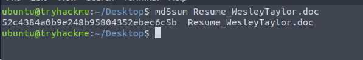
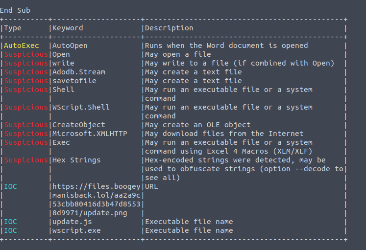
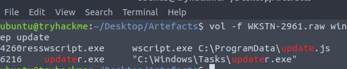
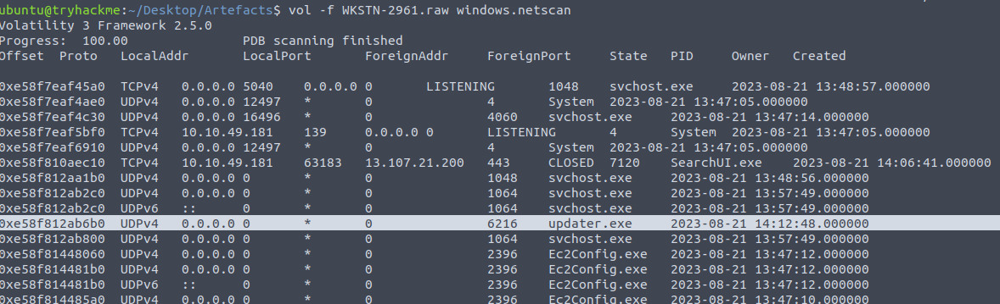

# Boogeyman2
# 🕵️ TryHackMe - Boogeyman2 (Tools: Volatility & Olevba)

## Overview

After having a severe attack from the Boogeyman, Quick Logistics LLC improved its security defences. However, the Boogeyman returns with new and improved tactics, techniques and procedures

Maxine, a Human Resource Specialist working for Quick Logistics LLC, received an application from one of the open positions in the company. Unbeknownst to her, the attached resume was malicious and compromised her workstation.

The security team was able to flag some suspicious commands executed on the workstation of Maxine, which prompted the investigation. Given this, you are tasked to analyse and assess the impact of the compromise.
---

### We can use this screenshot for questions 1-3

### Question 1: What email was used to send the phishing email?

**Answer:** `westaylor23@outlook.com`

---

### Question 2: What is the email of the victim employee?

**Answer:** `maxine.beck@quicklogisticsorg.onmicrosoft.com`

---

### Question 3: What is the name of the attached malicious document?

**Answer:** `Resume_WesleyTaylor.doc`

---

### Question 4: What is the MD5 hash of the malicious attachment?

**Explanation:** Save the file, open a new terminal and `md5sum <filename>`

**Answer:** `52c4384a0b9e248b95804352ebec6c5b`

---

### Question 5: What URL is used to download the stage 2 payload based on the document's macro?

**Explanation:**: In our tool `olevba <filename>`, under our IOC we'll see our filepath

**Answer:** `https://files.boogeymanisback.lol/aa2a9c53cbb80416d3b47d85538d9971/update.png`

---

### Question 6: What is the name of the process that executed the newly downloaded stage 2 payload?

**Explanation:**: Also under our IOC in olevba. Additionally we can confirm in volatility by checking windows.cmdline

**Answer:** `wscript.exe`

---

### Question 7: What is the full file path of the malicious stage 2 payload?

**Explanation:** In volatility, `vol -f WKSTN-2961.raw windows.cmdline | grep update`

**Answer:** `C:\ProgramData\update.js`

### Question 8: What is the PID of the process that executed the stage 2 payload?

**Explanation:** `vol -f WKSTN-2961.raw windows.pslist & cmdline` shows the list of processes, as I went through this lab I noticed updater.js > updater.exe in the windows.cmdline
**Answer:** `PID: 4260`

### Question 9: What is the parent PID of the process that executed the stage 2 payload?

**Explanation:** Checking the parent pid of the same .exe. 
**Answer:** `PPID: 1124`

### Question 10: What URL is used to download the malicious binary executed by the stage 2 payload?

**Explanation:** There are a few ways to find this answer, simple one if the IOC on olevba report. 
**Answer:** `https://files.boogeymanisback.lol/aa2a9c53cbb80416d3b47d85538d9971/update.exe`

### Question 11: What is the PID of the malicious process used to establish the C2 connection?

**Explanation:** Back to tracking updater.exe, check outbound connections with windows.netstat
**Answer:** `PID: 6216`

